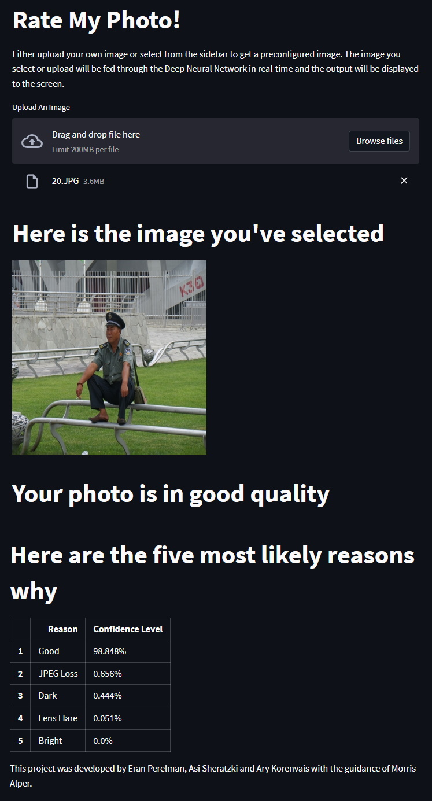

# Best Photo Selection

Giving a score for how good or bad a photograph is. Explaining the reasons behind the choice.

This project was developed by Eran Perelman, Asi Sheratzki and Ary Korenvais with the guidance of Morris Alper.

A link the website hosting the app: [Rate My Photo!](https://eranper-best-photo-selection-srcrate-my-photo-4ipizc.streamlitapp.com/)

Technologies used: 
* Anaconda
* Python
* Numpy
* Pandas
* openCV
* Pillow
* Tensorflow
* Streamlit

# Summary
This project involved using Deep Convolutional Neural network to create a machine learining application that could classify the quality of an image by different aspects. The final model architecture is a [Inceptionv3](https://en.wikipedia.org/wiki/Inceptionv3) that was initially trained on the [ImageNet Dataset](https://en.wikipedia.org/wiki/ImageNet). Transfer learning was utilized to fine tune the ImageNet model to learn how to classify the quality of an image. After training, the model correctly identified 97% of different aspects of quality, such as lens flare, motion blur, and others, out from training. The trained model was then deployed in an interactive website to allow users to check the quality of their own pictures.

# Introduction
There is a rise in the usage of smartphone and digital cameras in recent years. People are taking digital photos everywhere, anytime on a large scale and the need for quality over quantity is needed when the storage is limited on smartphones, SD cards and cloud services. The user wants to keep the best photos and share them with family, on social networks, and remove the bad taken photos from the limited device's storage or the limited cloud service’s storage.

# Dataset
The dataset used for this project was found [on Kaggle](https://www.kaggle.com/datasets/hsankesara/flickr-image-dataset). The dataset includes over 30k photos from Flicker. Flickr is an American image hosting and video hosting service, as well as an online community, founded in Canada and headquartered in the United States. It was created by Ludicorp in 2004 and was a popular way for amateur and professional photographers to host high-resolution photos. The hard part was to find "bad" images from a technical aspect, but also from our point of view, as what we consider as a "bad" photo.

That's why we used data augmentation. Data augmentation in data analysis are techniques used to increase the amount of data by adding slightly modified copies of already existing data or newly created synthetic data from existing data. It acts as a regularizer and helps reduce overfitting when training a machine learning model. We created several filters to generate "bad" photos from the "good" set of images. These new synthetic "bad" photos are now too much dark, too much bright, have lens flare and motion blur (movement of the camera) and also have low quality due to JPEG loss.

The second dataset was our own collection of "bad" photos, in a way of what we consider as "bad" (or "good" in that matter). It was also a challenge to find the "bad" photos in our collection, due to the fact we mostly delete these bad photos from our phones over time. We collected a total number of 1200 photos of "good" and "bad" images and train another model for our organic data.

# Model Architecture

A Vgg16 model was used as the baseline binary classification model for our project. We used 7000 "bad" photos and another 7000 "good" photos for training. We got a prediction score for how "good" quality the photo is and by a threshold of 0.5 to decide if the image is "good" or bad".

We tried more advanced models for binary classification usage:
* ResNet50.
* Inceptionv3.
* EfficientNetB0.
* EfficientNetB7.

Because of its highest accuracy, an Inceptionv3 model was used as the final advanced model for our project.

# Model Scores

| Method | dataset | Filter set # | Accuracy | Precision (Bad) | Precision (Good) |
| --- | --- | --- | --- | --- | --- |
| Vgg16 | flicker30k | Synthetic 1 | 0.79 | 0.74 | 0.85 |
| Vgg16 | flicker30k | Synthetic 2 | 0.81 | 0.76 | 0.85 |
| Vgg16 | flicker30k | Synthetic 3 | 0.87 | 0.89 | 0.86 |
| ResNet50 | flicker30k | Synthetic 3 | 0.96 | 0.94 | **0.99** |
| InceptionV3 | flicker30k | Synthetic 3 | **0.97** | **0.98** | 0.95 |
| EfficientNetB0 | flicker30k | Synthetic 3 | 0.86 | 0.82 | 0.91 |
| EfficientNetB7 | flicker30k | Synthetic 3 | 0.79 | 0.72 | 0.86 |

Here are examples of both a Barn Swallow and a Tree Swallow. Can you identify which is which?
### Barn Swallow:

### Tree Swallow:

The results for the models that were trained on our own organic data were lower in accuracy compared to the synthetic dataset.

| Method | dataset | Filter set # | Accuracy | Precision (Bad) | Precision (Good) |
| --- | --- | --- | --- | --- | --- |
| Vgg16 | Internal | Organic | 0.82 | 0.81 | 0.83 |
| ResNet50 | Internal | Organic | 0.83 | 0.83 | 0.84 |

We continued with Inceptionv3 architecture for building a multilabel image classification model.

# Streamlit App

We created a publically hosted application using Streamlit to showcase this project and allow users to interact with the trained model with a no-code implimentation. Users can select from example images or they can upload their own image and see how the model would classify it.

The app outputs a table of the top five predictions including confidence levels of each prediction

# Future Plans
I have several ideas to improve this project:
* Add explanations for how the CNN works with multiple levels of explanation depending on user selection of dropbox
* If predicted confidence is under some threshold, say something about not being sure about the prediction
* Potentially have a stacked model where the first model predicts if the image is a bird or not - if not, do something funny to the user for trying to trick me

Project Organization
------------

    ├── LICENSE
    ├── Makefile           <- Makefile with commands like `make data` or `make train`
    ├── README.md          <- The top-level README for developers using this project.
    ├── data
    │   ├── external       <- Data from third party sources.
    │   ├── interim        <- Intermediate data that has been transformed.
    │   ├── processed      <- The final, canonical data sets for modeling.
    │   └── raw            <- The original, immutable data dump.
    │
    ├── docs               <- A default Sphinx project; see sphinx-doc.org for details
    │
    ├── images             <- Images for visualizations on notebooks and other documents.
    │
    ├── models             <- Trained and serialized models, model predictions, or model summaries
    │
    ├── notebooks          <- Jupyter notebooks. Naming convention is a number (for ordering),
    │                         the creator's initials, and a short `-` delimited description, e.g.
    │                         `1.0-jqp-initial-data-exploration`.
    │
    ├── references         <- Data dictionaries, manuals, and all other explanatory materials.
    │
    ├── reports            <- Generated analysis as HTML, PDF, LaTeX, etc.
    │   └── figures        <- Generated graphics and figures to be used in reporting
    │
    ├── requirements.txt   <- The requirements file for reproducing the analysis environment, e.g.
    │                         generated with `pip freeze > requirements.txt`
    │
    ├── setup.py           <- makes project pip installable (pip install -e .) so src can be imported
    ├── src                <- Source code for use in this project.
    │   ├── __init__.py    <- Makes src a Python module
    │   │
    │   ├── data           <- Scripts to download or generate data
    │   │   └── make_dataset.py
    │   │
    │   ├── features       <- Scripts to turn raw data into features for modeling
    │   │   └── build_features.py
    │   │
    │   ├── models         <- Scripts to train models and then use trained models to make
    │   │   │                 predictions
    │   │   ├── predict_model.py
    │   │   └── train_model.py
    │   │
    │   └── visualization  <- Scripts to create exploratory and results oriented visualizations
    │       └── visualize.py
    │
    └── tox.ini            <- tox file with settings for running tox; see tox.readthedocs.io

--------

<small>Project based on the <a target="_blank" href="https://drivendata.github.io/cookiecutter-data-science/">cookiecutter data science project template</a>. #cookiecutterdatascience</small>

